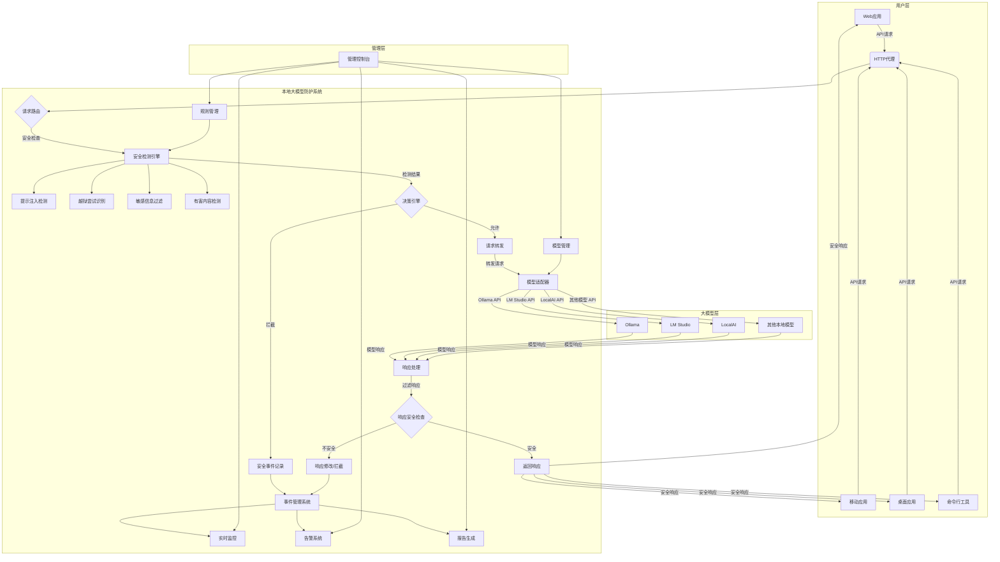

# 本地大模型防护系统可视化架构

## 架构组件详解

### 1. 用户层

用户通过各种应用与系统交互：
- **Web应用**：浏览器中运行的应用
- **移动应用**：iOS/Android应用
- **桌面应用**：Windows/Mac/Linux桌面应用
- **命令行工具**：终端中运行的工具

### 2. 本地大模型防护系统

系统核心组件：

- **HTTP代理**：接收所有API请求的入口点
- **请求路由**：将请求分发到相应的处理模块
- **安全检测引擎**：系统的核心安全组件
  - **提示注入检测**：识别和阻止提示注入攻击
  - **越狱尝试识别**：检测绕过安全限制的行为
  - **敏感信息过滤**：保护个人信息和敏感凭证
  - **有害内容检测**：过滤不当内容
- **决策引擎**：根据安全检测结果决定请求处理方式
- **请求转发**：将安全请求转发给大模型
- **模型适配器**：适配不同大模型的API格式
- **响应处理**：处理大模型返回的响应
- **响应安全检查**：检查响应内容的安全性
- **响应修改/拦截**：对不安全的响应进行处理
- **安全事件记录**：记录安全事件
- **事件管理系统**：管理和分析安全事件
  - **实时监控**：实时监控系统状态
  - **告警系统**：发送安全告警
  - **报告生成**：生成安全报告
- **规则管理**：管理安全规则
- **模型管理**：管理大模型配置

### 3. 大模型层

支持多种本地大模型：
- **Ollama**：轻量级大模型运行时
- **LM Studio**：大模型测试和运行工具
- **LocalAI**：本地AI服务
- **其他本地模型**：其他支持的大模型

### 4. 管理层

- **管理控制台**：提供图形化界面进行系统管理
  - 配置安全规则
  - 管理模型
  - 查看监控数据
  - 处理告警
  - 生成报告

## 数据流程

1. 用户应用发送API请求到HTTP代理
2. 请求路由将请求发送到安全检测引擎
3. 安全检测引擎对请求进行全面检查
4. 决策引擎根据检测结果决定是拦截还是允许请求
5. 如果请求安全，通过模型适配器转发到相应的大模型
6. 大模型生成响应并返回
7. 响应处理模块接收响应并进行安全检查
8. 如果响应安全，返回给用户应用
9. 如果响应不安全，进行修改或拦截
10. 所有安全事件记录到事件管理系统
11. 管理员通过管理控制台监控和管理整个系统
